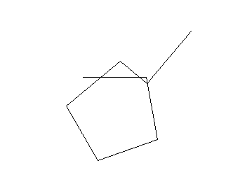

# Logo语法测试用例
## 变量
#### 测试语句
`make n 100` 
#### 效果

## 数学函数
#### 开方
`sqrt 100 | sqrt :n`
#### 效果

#### 求平方
`power 2 3 | power :n 2`
#### 效果

#### 求对数
`ln 100 | ln :n | log10 :n | exp 2`
#### 效果

#### 随机数
`random 100`
#### 效果

## 画图
#### 测试语句
`repeat 4 [fd 100 rt 90] | repeat 4 [repeat 4 [fd 100 rt 90] rt 90] |repeat 8 [repeat 4 [fd 100 rt 90] rt 45]`
#### 效果

#### 测试语句
`repeat 8 [repeat 4 [fd 100 rt 90] rt 45]`
#### 效果

#### 抬起放下笔
`fd 80 rt 90 fd 80 rt 90 fd 80 rt 90 fd 80 |
pu bk 20 rt 90 fd 20 pd |
fd 40 rt 90 fd 40 rt 90 fd 40 rt 90 fd 40`
#### 效果

#### 清空屏幕
`repeat 4 [fd 100 rt 90]` and `ct`
#### 效果

#### 标签
`make s "hello logo!" | setpensize 1 | label :s`
#### 效果

## 条件语句
`if 10 >= 5 [repeat 4 [fd 90 rt 80]] | if 10 > 20 [fd 10] else [fd 100 rt 80 fd 50 lt 90 fd 100]`
#### 效果

## 循环语句
`while 10 > 0 [repeat 4 [fd 90 rt 80]]`
#### 效果

## 函数
#### 定义并调用函数
`to square [:n] repeat 4 [fd :n rt 90] end | square[100]`
#### 效果

